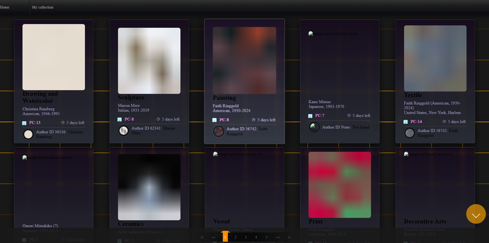
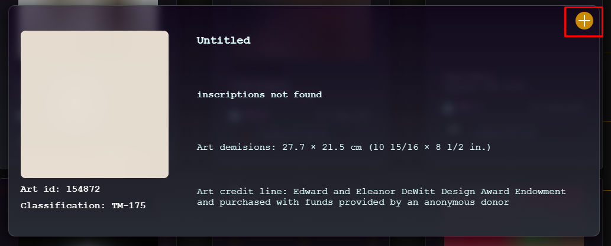
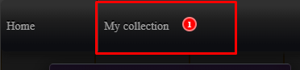
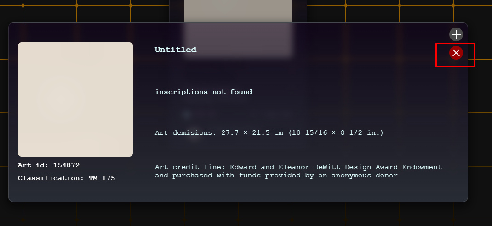

### STATIONPROJECT2_ARAM_ARAKELYAN


### 💫 Project Description:
The task involved creating a mini-project to interact with external APIs. This project fetches data from the <b>api.artic.edu</b>.

### 🚀 Key Features:
Fetch Requests: Utilizes fetch requests to communicate with external APIs.
Modular Code Structure: All separate components and reusable code snippets are encapsulated into individual files as callable functions.
Reactivity Logic: Implements reactivity logic, ensuring that only modified parts of the page are updated upon data changes.
Single Page Application (SPA) Logic: The project utilizes a single-page application approach, with all logic implemented in JavaScript.

### 🛠 Tools used:
[](https://github.com/)
[](https://code.visualstudio.com/)


### 🏴 Used in the project:
[](https://developer.mozilla.org/en-US/docs/Web/HTML)
[](https://developer.mozilla.org/en-US/docs/Web/CSS)
[](https://developer.mozilla.org/en-US/docs/Web/JavaScript)


### ♻ Used packages:
<p>- no packages were used</p>

### 📚 Usage:

1. **💻 Installation:**
- Clone the repository to your local machine:
    ```bash
    git clone https://github.com/blackrainbowtest/StationProject2_aram_arakelyan.git
    ```
- Alternatively, you can click the "Code" button at the top of the repository page and select "Download ZIP" to download the repository as a ZIP file.

2. **🚀 Running the Project:**
   - Open the `index.html` file in your web browser.

3. **🤝 Interacting with the Project:**
   - **Browsing Data:** Users can scroll through the displayed data to explore different items.
  
    - **Pagination:** If the dataset is large, pagination controls allow users to navigate through multiple pages of data.
    
    - **Adding to Favorites:** Users have the option to add specific items to their favorites list for easy access.
    
    - **Viewing Favorites:** There is a dedicated section where users can view all items they have marked as favorites.
    
    - **Removing from Favorites:** Users can remove items from their favorites list if they no longer wish to keep them.

4. **🌟 Example Usage:**
   Here are some screenshots of the project:

    - **Main Page:**
    

    - **Adding to Favorites:**
    

    - **Favorites Section:**
    

    - **Removing from Favorites:**
    


### 🤝 Contribution:

    ## How to Contribute
    
    - **Bug fix:** If you have found a bug or want to suggest an improvement, please create a new [Issue](https://github.com/blackrainbowtest/StationProject2_aram_arakelyan/issues) with a detailed description.
    - **Code changes:** If you'd like to make changes to the code, fork the repository, make the necessary modifications, and submit a [Pull Request](https://github.com/blackrainbowtest/StationProject2_aram_arakelyan/pulls).

    ## Code Style
    Please adhere to the project's general coding guidelines and style. If you have any questions or concerns, feel free to ask for assistance.

### 📝 License:
    This project is licensed under the [MIT License](https://github.com/blackrainbowtest/StationProject2_aram_arakelyan/blob/main/LICENSE).

### 📧 Contact:
    If you have any questions or suggestions, don't hesitate to [get in touch with me](https://github.com/blackrainbowtest).

### 💖💙🧡 Thank you for your interest in the project!
